# SOLID Principles Learning Materials

## SOLID Principles

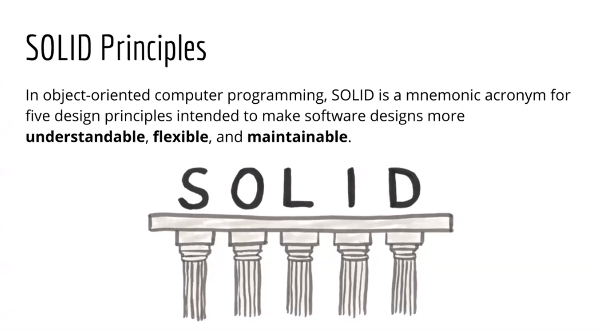

## Single Responsibility Principle

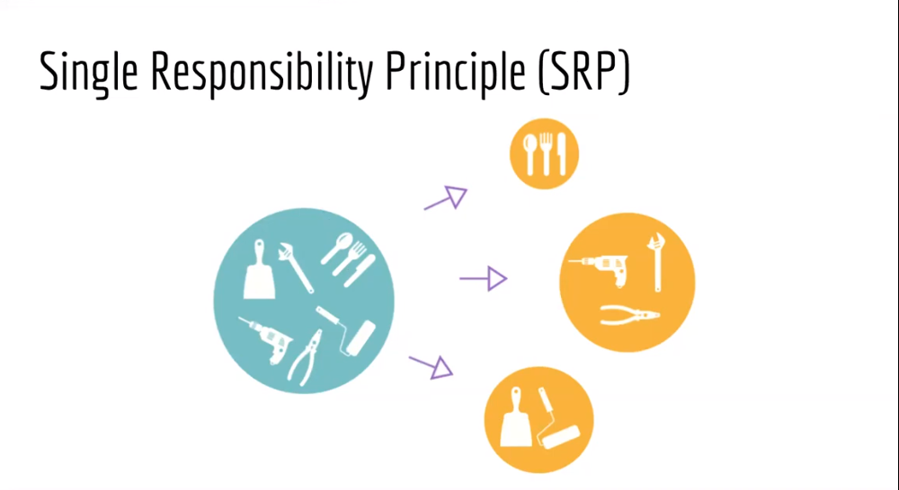

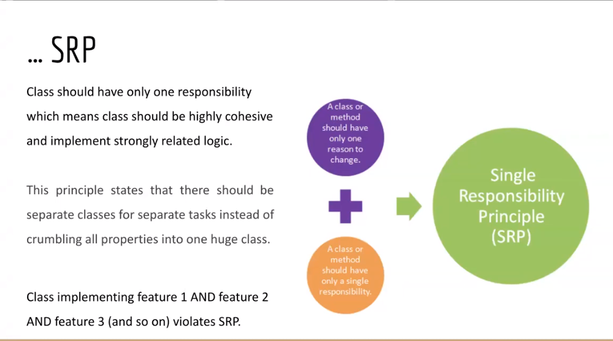

## Open Closed Principle

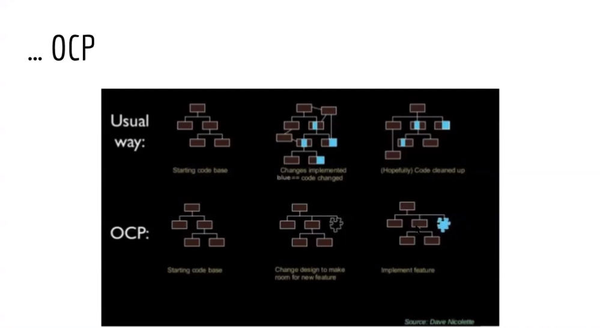

## Liskov Substitution Principle

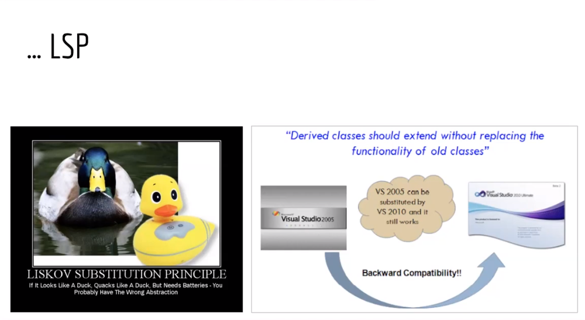

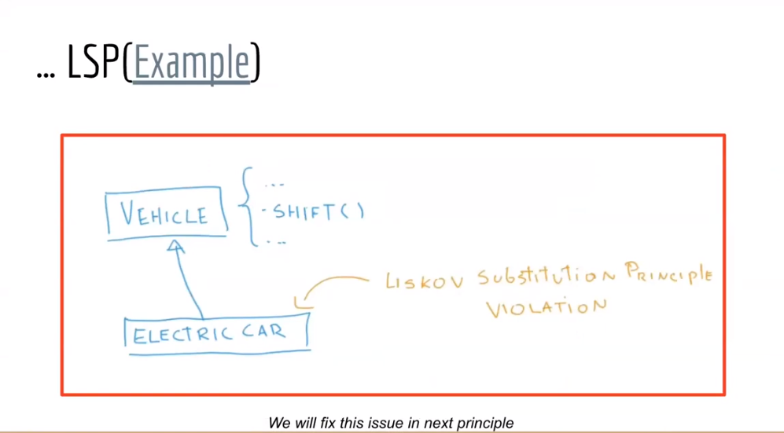

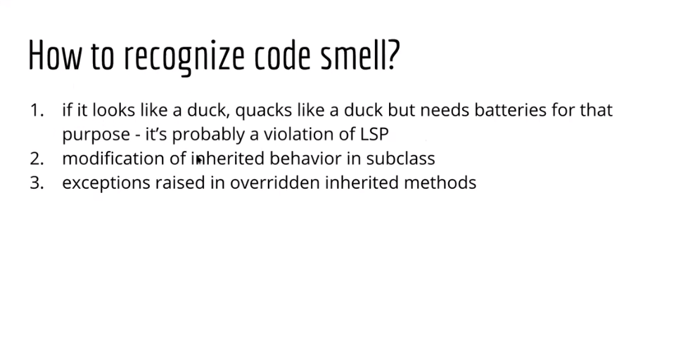

## Interface Seggregation Principle

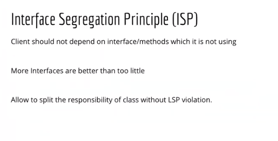

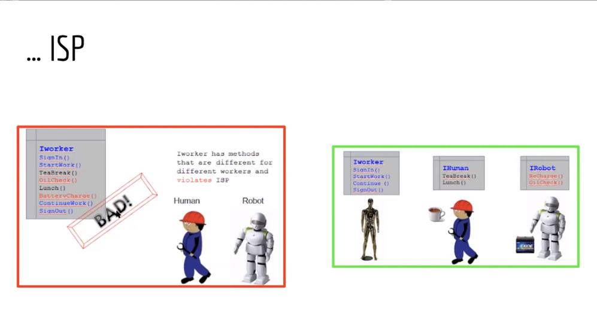

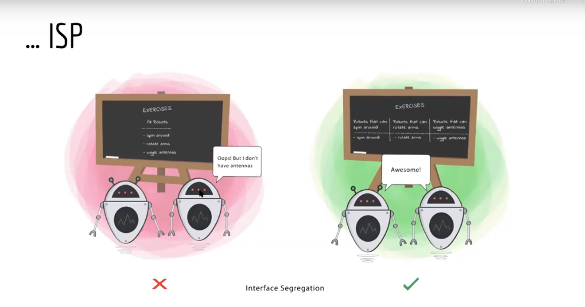

### Solution to the problem we faced in Liskov Substitution Principle

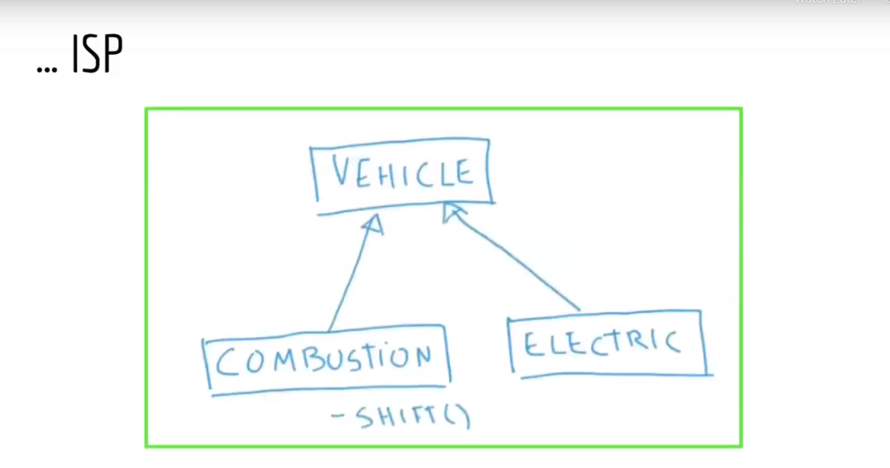

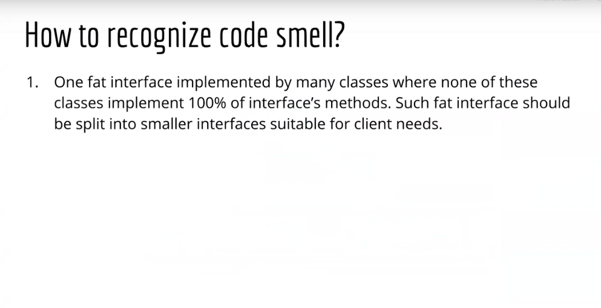

## Dependency Inversion Principle

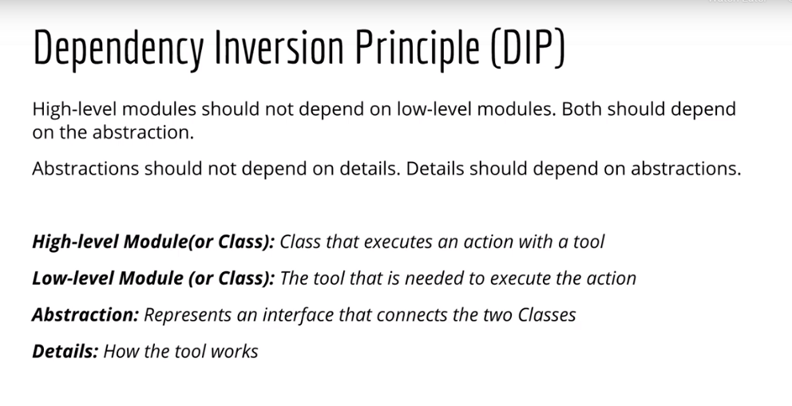

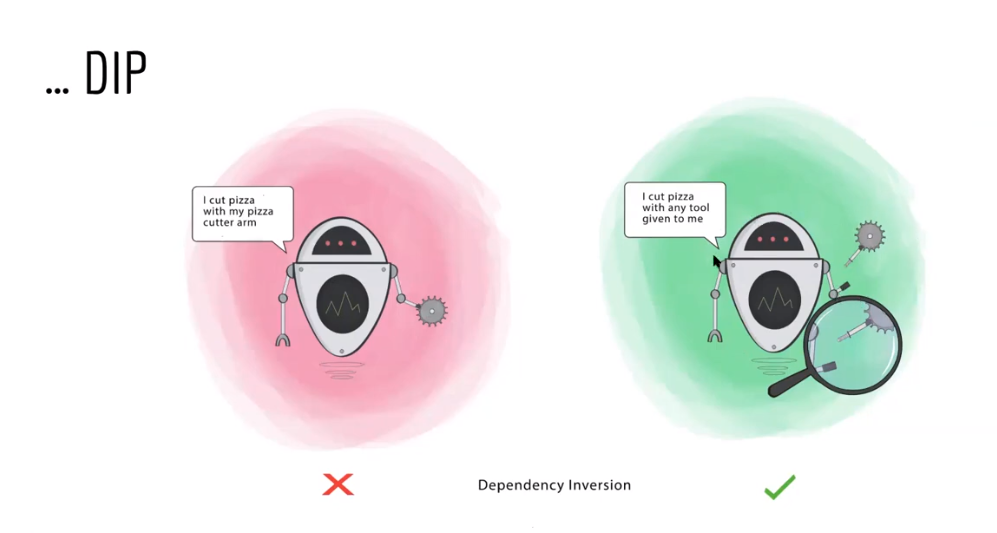
