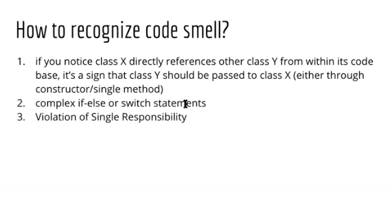

# SOLID Principles Learning Materials

## SOLID Principles

## Single Responsibility Principle

## Open Closed Principle

## Liskov Substitution Principle

## Interface Seggregation Principle

### Solution to the problem we faced in Liskov Substitution Principle

## Dependency Inversion Principle

